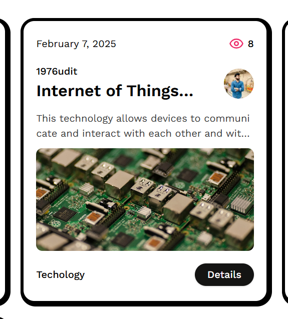

# Startup Ideas Hub

A Next.js application for sharing and exploring startup ideas. This app uses Sanity as a backend service, supports Server-Side Rendering (SSR) and Static Site Generation (SSG), and is styled with Tailwind CSS and Shadcn components.

## Features

- **Create and Share Startup Ideas**: Users can create and share their startup ideas.
- **Sanity Backend**: Content is managed using Sanity CMS.
- **SSR and SSG**: Utilizes Next.js's SSR and SSG techniques for optimal performance.
- **Tailwind CSS**: Styled using Tailwind CSS for a modern and responsive design.
- **Shadcn Components**: Reusable and customizable UI components from Shadcn.

## Technologies Used

- [Next.js](https://nextjs.org/) - React framework for server-rendered applications.
- [Sanity](https://www.sanity.io/) - Headless CMS for managing content.
- [Tailwind CSS](https://tailwindcss.com/) - Utility-first CSS framework.
- [Shadcn](https://shadcn.com/) - Collection of reusable UI components.

## Getting Started

### Prerequisites

- Node.js (v16 or higher)
- npm or yarn
- Sanity CLI (if you want to manage the Sanity backend locally)

### Installation

1. **Clone the repository:**

   ```bash
   git clone https://github.com/your-username/startup-ideas-hub.git
   cd startup-ideas-hub




Open [http://localhost:3000](http://localhost:3000) with your browser to see the result.

You can start editing the page by modifying `app/page.tsx`. The page auto-updates as you edit the file.

This project uses [`next/font`](https://nextjs.org/docs/app/building-your-application/optimizing/fonts) to automatically optimize and load [Geist](https://vercel.com/font), a new font family for Vercel.

## Learn More

To learn more about Next.js, take a look at the following resources:

- [Next.js Documentation](https://nextjs.org/docs) - learn about Next.js features and API.
- [Learn Next.js](https://nextjs.org/learn) - an interactive Next.js tutorial.

You can check out [the Next.js GitHub repository](https://github.com/vercel/next.js) - your feedback and contributions are welcome!

## Deploy on Vercel

The easiest way to deploy your Next.js app is to use the [Vercel Platform](https://vercel.com/new?utm_medium=default-template&filter=next.js&utm_source=create-next-app&utm_campaign=create-next-app-readme) from the creators of Next.js.

Check out our [Next.js deployment documentation](https://nextjs.org/docs/app/building-your-application/deploying) for more details.
